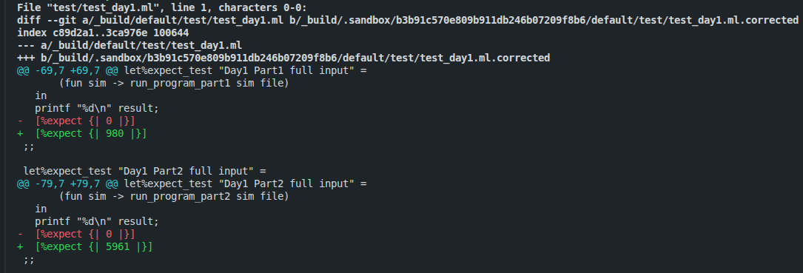
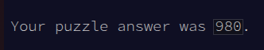
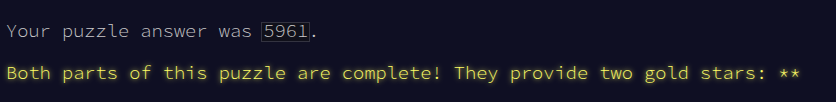

# Advent of FPGA 2025

Here's my solution to the Day1 Problem of Advent of Code in HardCaml.

## Repo Structure and Implementation

```
├── Advent-of-FPGA-2025
│   ├── bin - Binary build targets
│   ├── src - FPGA designs and input-parser
│   ├── test - Tests to simulate on sample input
```
I began by cloning Jane Street's HardCaml Project Template and have editted it for solving the problem.

### Part 1:

The solution to this problem can be viewed in src/day1.ml.

#### Input

The input module contains clock, clear, start, finish, dir, and value (10 bits) as signals.

dir = 0 represents right and dir = 1 represents left.

value is the magnitude of rotation of the dial.

I have assumed that the dial is not rotated more than 1023 in a single instruction. For larger inputs, value must have more number of bits.

#### Output

The output module contains the key signal which I have assigned 13 bits. Admittedly, this number is arbitrary.

#### States

I have implemented a finite state machine with two states, idle and running. When start is active high, the state shifts from idle to running, and when finish is active high, the state shifts from running to idle.

#### create

The main solution uses two registers: loc and key. loc is of size 8 bits because it's value is always less than 100 but on adding effective_value which can be upto 99, it can be as big as 198 and thus, I needed 8 bits to store it.
I defined effective_value to calculate value (modulo 100) and used List.fold to define it. Initially, I wrote this using nested mux2's. I prompted Gemini for a better way to write it, and it suggested that I use List.fold, and that's what I've done.
There are two 8-bit wires backward-next and forward-next to compute the next locations in each case.
Then, I use a mux2 to decide which location to go to next.
I've used an Always block where in the Idle state, loc is initialised to 50 and key to zero, and when start is active high, the state shifts to Running.
In the Running state, at every clock edge, loc changes to next_loc, and whenever next_loc is 0, key is incremented. 
When finish is active high, the state changes to Idle.

#### hierarchical

This is used for RTL generation.


### Part 2:

The part 2 solution can be viewed in bin/day1_part2.ml.

The solution is largely the same as part1, except, I have defined key with size 14 bits, and have defined two wires: wraps and increment of size 4 bits and 1 bits respectively. wraps is value/100. For example, if value is 850, the dial crosses 0 at least 8 times and thus, wraps = 8. Increment calculates whether the dial crosses 0 one more time or not based on the effective value. wraps is of 4 bits because I'm still assuming that value is less than 1024, and thus, it is less than equal to 10. increment can only be 0 and 1 and thus is 1 bit. Also, here key is always incremented by wraps and increment.

### Verification:

Tests are located in test/test_day1.ml. I utilized Cyclesim for functional simulation and verified the design against the official Advent of Code test cases.



These responses correctly answer my testcase for Advent of Code.




### Concluding Thoughts:

Thanks to Jane Street for having this challenge. I got to learn more about FPGAs, OCaml, and HardCaml through this challenge. It was pretty interesting! While I have solved only one problem, I'd be quite interested in revisiting this challenge and solving more problems later.

### References:
I referred to the following resources:
* [HardCaml Mini Course at Stevens](https://hardcaml-mini-course-at-stevens.github.io/hardcaml-docs/introduction/why/)
* [Learn HardCaml in Half an Hour](https://ocamlstreet.gitbook.io/hardcaml-wiki/learn-hardcaml-in-half-an-hour)
* [Advent of HardCaml 2024](https://github.com/asinghani/advent-of-hardcaml-2024/blob/main/fpga/src/day01.ml)
